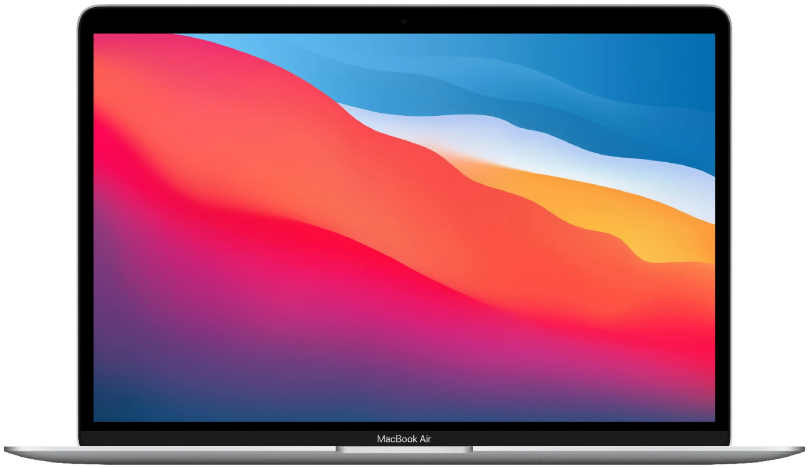

<!DOCTYPE html>
<html lang="en">
  <head>
    <meta charset="UTF-8" />
    <meta http-equiv="X-UA-Compatible" content="IE=edge" />
    <meta name="viewport" content="width=device-width, initial-scale=1.0" />
    <title>Our Strong</title>
    <link rel="stylesheet" href="macet.css" />
    <link rel="icon" href="icon.png" />
  </head>
  <body>
    <header>
      <nav>
        
HOME

        
PORTFOLIO

        

          <a href="#id_about_us" class="about_us">ABOUT US</a>
        

        

          <a href="#id_contact" class="contact"> CONTACT </a>
        

      </nav>
      

        

          <h1>our strong organaisation</h1>
          

            Lorem ipsum dolor sit amet, consectetur adipis cing elit, sed do
            eiusmod tempor incididunt ut labore et. ectetur adig ipis cing elit,
            sed do eiusmod tempor incididunt.
          

          <button class="buttonn">
            Contact Us
          </button>
        

        

          
        

      

    </header>
    <main>
      

        

          <h3>DO YOU KNOW WE CAN PROVIDE FOR YOU?</h3>
          

            Lorem ipsum dolor sit amet, consectetur adipis cing elit, sed do
            eiusmod tempor incididunt ut labore et.Lorem ni ipsum dolor sit
            amet, consectetur adipis cing elit, ed doi eiusmod tempor incididunt
            ut labore et.
          

           
          <button class="learn">Learn more</button>
        

        

          

            

              
              <h6 class="list3_h6">Management</h6>
              

                Lorem ipsum dolor sitea amet, zixf conseit adipi cing elit,
                seddi do eiusmod btdempor in didunt utlae ore etioe.Lorem ipsum
                new idolor sit amet,
              

            

            

              
              <h6 class="list3_h6">UI /UX Design</h6>
              

                Lorem ipsum dolor sitea amet, zixf conseit adipi cing elit,
                seddi do eiusmod btdempor in didunt utlae ore etioe.Lorem ipsum
                new idolor sit amet,
              

            

          

          

            

              
              <h6 class="list3_h6">Logo / Branding</h6>
              

                Lorem ipsum dolor sitea amet, zixf conseit adipi cing elit,
                seddi do eiusmod btdempor in didunt utlae ore etioe.Lorem ipsum
                new idolor sit amet,
              

            

            

              
              <h6 class="list3_h6">Animation</h6>
              

                Lorem ipsum dolor sitea amet, zixf conseit adipi cing elit,
                seddi do eiusmod btdempor in didunt utlae ore etioe.Lorem ipsum
                new idolor sit amet,
              

            

          

        

      

      

        <h5 class="search_h5">
          Design tips, tricks, and freebies. Delivered weekly.
        </h5>
        

          Lorem ipsum dolor sit amet, consectetur adipis cing elit, sed do
          eiusmod.
        

         
        <input
          type="search"
          class="search_input"
          placeholder="Emeil Adress..."
        />
        <button class="search_button">SUBSCRIBE</button>
      

      

        

          <h3>GET IN TOUCH</h3>
          

            Lorem ipsum dolor sit amet, consectetur adipis cing elit, sed do
            eiusmod tempor incididunt ut labore et.ur adipis cing elit, sed do
            eiusmod tempor incididunt ut labore et. ur adipis cing elit, sed do
            eiusmod tempor incididunt ut labore et.
          

          

          <form action="">
            <input
              type="text"
              class="form_name form_border"
              placeholder="name"
            />
            <input
              type="text"
              class="form_mail form_border"
              placeholder="mail"
            />
             
            <textarea
              name=""
              id=""
              cols="30"
              rows="10"
              class=""
              placeholder="Type your message"
            ></textarea>
             
            <!-- <input type="submit" class="form_submit" /> -->
            <button class="form_submit">SEND MESSAGE</button>
          </form>
        

        

          

            <h6 class="form2_chapter" id="id_contact">CONTACT INFO</h6>
            

              Jalalabad 24 / A, Ambaarkhana, Sylhet, Bangladesh
            

            
redwan@deviserweb.com

            
(+88) 017 617 46373

          

        

      

    </main>
    <footer>
      

        

          

            © Copyright @Junaed 2016, All rights reserved.
          

        

        

        

          

            
          

          

            
          

          

            
          

          

            
          

        

      

    </footer>
  </body>
</html>
